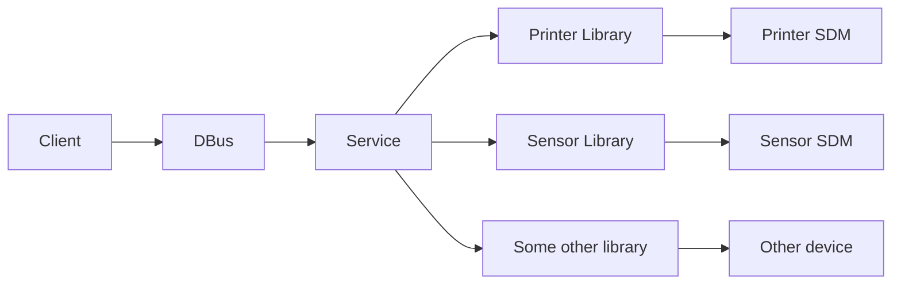

# Libre XFS

LibreXFS is a community open source project to develop and support open and free eXtensions for Financial Services with priority on Linux support.

The goal of this project is to develop a robust and efficient XFS (eXtensions for Financial Services) platform for Linux, utilizing D-Bus as the communication medium. The XFS platform will be designed to facilitate seamless communication between ATM applications and various ATM devices, such as cash dispensers, card readers, receipt printers, and more.

D-Bus, a message bus system that allows communication between different processes or applications within a Linux system, will serve as the communication layer for this XFS platform. It will provide a standardized and reliable means of exchanging messages, commands, and events between the ATM applications and the ATM devices, enabling seamless integration and interoperability.

The project will involve the development of service provider modules (SPMs) that adhere to the XFS standard and implement the necessary functionalities for communicating with different types of ATM devices. These SPMs will be responsible for interfacing with the respective ATM devices and translating requests and responses between the ATM applications and the devices, using D-Bus as the communication medium.

The XFS platform will also include an XFS manager software that will handle the overall coordination and management of the communication between the SPMs and the ATM applications. This manager software will be responsible for routing messages, managing device states, handling errors, and ensuring proper synchronization and flow control between the different components of the XFS platform.

The project will require expertise in XFS standard, Linux system programming, D-Bus communication, and software development using C/C++ or other relevant programming languages. It will involve designing and implementing efficient communication protocols, handling various types of ATM devices, ensuring robust error handling and fault tolerance, and testing the XFS platform extensively for reliability and performance.

Upon successful completion, the XFS platform for Linux with D-Bus communication will provide a solid foundation for building ATM applications on Linux that can seamlessly communicate with different types of ATM devices, offering enhanced flexibility, interoperability, and ease of integration for ATM software developers.

## Features

- XFS Compliance: The platform will adhere to the XFS standard, ensuring compatibility with a wide range of ATM devices and applications.

- D-Bus Communication: The platform will utilize D-Bus as the communication medium for seamless and standardized messaging between ATM applications and devices.

- Service Provider Modules (SPMs): Development of SPMs for different types of ATM devices, such as cash dispensers, card readers, receipt printers, etc., to handle device-specific functionalities.

- XFS Manager: An XFS manager software that will handle the overall coordination and management of the communication between the SPMs and the ATM applications, including message routing, device state management, error handling, and flow control.

- Device Discovery and Configuration: Support for automatic device discovery and configuration, allowing easy integration of new ATM devices into the system.

- Robust Error Handling: Comprehensive error handling mechanisms to detect and handle errors arising from communication failures, device malfunctions, or other exceptions, ensuring system stability and reliability.

- Event Notification: Support for event-driven communication, allowing ATM applications to receive real-time notifications about events, such as cash replenishment, card insertion, etc., from the ATM devices.

- Device Status Monitoring: Monitoring of device status and health, providing detailed information about the operational state of ATM devices for proactive maintenance and troubleshooting.

- Security Features: Implementing security measures, such as authentication, encryption, and access control, to ensure the confidentiality and integrity of data exchanged between ATM applications and devices.

- Extensibility: Designing the platform to be easily extensible, allowing for future enhancements, updates, and integration with new technologies or standards.

- Testing and Validation: Rigorous testing and validation of the XFS platform to ensure its reliability, performance, and compliance with XFS standard and Linux system requirements.

- Documentation and Support: Comprehensive documentation and support resources for ATM software developers, including API documentation, sample code, and technical support channels.

## Supported devices

- **CDM (Cash Dispenser)**: This device class represents a cash dispenser, which dispenses cash notes to customers in various denominations.

- **CRD (Card Reader)**: This device class represents a card reader, which reads and processes data from magnetic stripe or chip-based cards, including credit/debit cards, EMV cards, and other types of cards.

- **PTR (Printer)**: This device class represents a printer, which can print transaction receipts, balance statements, passbook entries, and other types of documents.

- **PIN (PIN Pad)**: This device class represents a PIN pad, which is used for securely entering PIN numbers during card-based transactions.

- **IDP (Image Deposit)**: This device class represents an image deposit device, such as an image scanner, which can capture, process, and validate images for image-based deposit transactions.

- **CAM (Camera)**: This device class represents a camera, which can capture images or video for various purposes, such as customer identification, transaction verification, or surveillance.

- **MSR (Magnetic Stripe Reader)**: This device class represents a magnetic stripe reader, which can read data from magnetic stripes on cards or other magnetic media.
