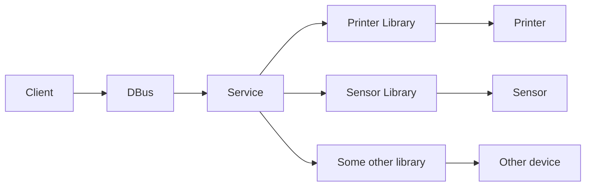

# Libre XFS

LibreXFS is a community open source project to develop and support open and free eXtensions for Financial Services with priority on Linux support.

Instead of 

## Features

## Key objectives

1. Maintain a collection of native device libraries
2. Provide client code examples
3. Develop and maintain reference services based on native device libraries

## Supported devices

* 
* [Sensor](
* [Some other device](
